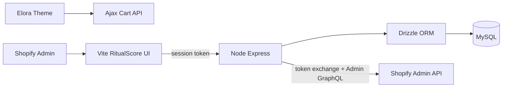

---
name: Shopify Take-Home MVP
overview: Elora (women scent/lotion/skincare theme — "Your everyday beauty ritual") + RitualScore (Vite/Node/Drizzle/MySQL app) — beauty-routine kits with Health Score.
todos:
  - id: confirm-branding
    content: "Create Partner app + dev store for locked names: Elora (theme) + RitualScore (embedded app)"
    status: pending
  - id: scaffold-stack
    content: "Scaffold monorepo: Skeleton theme, Express+Vite+Polaris app, Docker MySQL, Drizzle schema/migrations"
    status: pending
  - id: auth-embed
    content: Implement session-token auth, token exchange, shop/session persistence, embedded Polaris shell
    status: pending
  - id: app-domain
    content: Build ritual CRUD, Health Score engine, alerts, activity log, dashboard UI
    status: pending
  - id: theme-mvp
    content: "Brand Elora theme: core templates, 3+ sections, Soft Ritual Builder + Ajax cart"
    status: pending
  - id: docs-deliverables
    content: Write README setup + APP_DECISIONS.md; seed demo beauty products (cleanser, serum, lotion, mist); polish empty/error states
    status: pending
isProject: false
---

# Elora + RitualScore — Full Implementation Plan

Locked product: **Elora** (theme/store) + **RitualScore** (embedded app). Product pivot from ceramics to women's scent/lotion/skincare. Architecture unchanged. Answers sections 1–20 below.

**Brand lock**
- **Store name:** Elora
- **Tagline:** Your everyday beauty ritual.
- **Voice:** Soft, elegant, and distinctly feminine without being too literal.
- **Merchant app:** RitualScore (Admin SaaS; not customer-facing)

---

## Research notes (product pivot)

Sources: Amazon skincare bestsellers, Ulta skincare guides, Vogue simplified routine, TODAY 2026 body-care awards, beauty ecommerce market context (Forbes/Statista).

**Demand signals:** body lotions, barrier moisturizers, serums/toners, body washes, scented body layering (wash + lotion + mist), AM sunscreen as seal.

**Catalog for Elora:** face cleanser, toner/essence, serum (HA/niacinamide/vitamin C), moisturizer, sunscreen, body wash, body lotion/butter, body oil, body mist/perfume, lip balm, micellar water.

**Architecture impact:** Same RitualScore stack; component roles become `cleanse` | `treat` | `seal` (body kits map wash/lotion/mist onto those roles). Theme feature: Soft Ritual Builder.

---

## 1. Product & Store Concept

**Store:** Elora — a women-first DTC brand for daily necessities: scents, body lotions, and skincare sold as complete everyday rituals (AM glow, PM barrier, after-shower body) instead of orphaned single bottles. Tagline: **Your everyday beauty ritual.** Voice: soft, elegant, and distinctly feminine without being too literal.

**Customer problem:** Beauty overload — shoppers know they need cleanse + treat + moisturize (+ scent), but buying SKU-by-SKU creates incomplete routines, clashing scents, and wasted spend.

**Target customer:** Women ~22–40 who already buy personal care online; want simple, sensorial routines without a 12-step shelf.

**Why this vertical (for APP_DECISIONS):** Beauty & personal care is a major ecommerce category with strong online share; women are the primary buyers for these necessities; multi-product routines naturally power both the storefront builder and merchant kit-health scoring.

**Example kits:** AM Glow (cleanser + serum + moisturizer/SPF); Night Barrier (cleanser + treatment + night cream); Body Ritual (body wash + lotion + matching mist).

**Distinctive branding (not generic):**
- Porcelain #F6EFE8, blush sand #E8CFC4, ink #2A2420, sage #6F7F72
- Editorial bathroom-shelf / texture photography (not stock pink clutter or purple SaaS)
- Expressive typography; language of ritual, barrier, mist, seal — never cute, never clinical
- Full-bleed hero; one job per section

**Connected merchant problem:** Curated beauty routines break when a component goes OOS/unpublished or margin collapses — Admin does not show routine health.

**Why a real merchant needs it:** Beauty kit sellers lose conversion and trust when incomplete sets stay buyable; ops need ranked "what to fix first."

**Better than CRUD:** Health Score + ranked alerts + explainable breakdown. Create/update feeds scoring.

**Feels like SaaS:** Polaris-native UX, empty states, audit trail, documented scoring, Elora ↔ RitualScore cohesion in APP_DECISIONS.md.

**Names (locked):** Elora (store/theme) + RitualScore (embedded app). Former shortlist retired.

---

## 2. Embedded App Concept

**Core problem:** Merchants cannot see which curated product kits are healthy vs broken relative to live inventory and completeness.

**Target user:** Store owner / ops manager of a Shopify store selling complementary product sets (demo: Elora; generalizable to any kit merchant).

**Primary use case:** Define rituals (kits), map Shopify products as components, recalculate health, act on the worst kits first.

**End-to-end workflow:**
1. Install RitualScore → land on Dashboard (empty or ranked)
2. Create Ritual → name, description, threshold, components via Resource Picker
3. Save → score computed → activity logged → optional alert if below threshold
4. Dashboard ranks rituals; merchant opens alert / edits components
5. Recalculate after inventory changes; resolve alerts; review Activity

**Important actions:** Create/edit/archive ritual; add/remove/reorder components; set threshold; recalculate; resolve alerts; view activity.

**Decision info:** Score + breakdown (availability / completeness / margin proxy); which component failed; inventory hints; last computed time.

**Dashboard should communicate in <30s:** How many rituals are unhealthy; top 3 to fix; open alert count; CTA to create first ritual if empty.

**MVP in:** Dashboard, ritual CRUD, scoring + alerts, activity log, MySQL multi-table, OAuth/embed, Polaris UI.

**MVP out:** Billing, forecasting ML, auto-replenishment, theme app extension sync, real-time inventory webhooks (use manual recalculate), multi-user RBAC, multi-currency cost engines, App Store listing polish.

---

## 3. Logic-Based Feature — Ritual Health Score

**Strongest feature:** Deterministic **Health Score (0–100)** + ranking + threshold alerts + explainable breakdown.

**Why not ML forecasting:** Unreliable with sparse demo data; hard to explain; overengineered for take-home. Scoring + alerts shows product thinking cleanly.

**Inputs:**
- Component product/variant status (active/draft)
- Inventory quantity (Admin GraphQL)
- Required roles present (cleanse, treat, seal)
- Optional merchant-entered `unit_cost` vs Shopify price for margin proxy
- Merchant `score_threshold` (default 70)

**Calculation (documented, pure function):**
- Availability (0–50): share of components with `inventory > 0` and product active
- Completeness (0–20): required roles present (binary weights)
- Margin proxy (0–30): if costs set, clamp((price−cost)/price); if unset, award mid score (15) so MVP still works without cost entry

`score = availability + completeness + margin`

**Rules:** Alert `low_score` when score < threshold; Alert `component_unavailable` when any required component OOS/inactive; ranking = sort by score ASC (worst first) then open alerts.

**Merchant output:** Numeric score, status badge (Healthy / At risk / Broken), factor bars, "why" bullets ("Serum 'Glow Drops' has 0 inventory"), recommended action.

**Explainability:** Always show breakdown JSON rendered as UI factors — never a naked number.

**Edge cases:** No components → score 0 + validation; deleted Shopify product → treat unavailable + log; partial inventory; all costs null; threshold 0 or 100; shop uninstall mid-edit.

**Product thinking demo:** Prioritization of merchant time, not storage of rituals.

---

## 4. Dashboard & UX

**IA / screens:**
1. **Home (Dashboard)** — KPIs, ranked rituals, open alerts, primary CTA
2. **Rituals** — index table
3. **Ritual Create / Edit** — form + components
4. **Activity** — chronological log with filters
5. **Settings** — default threshold, recalculate-all

**Dashboard content:** Rituals count; Healthy / At risk / Broken counts; Open alerts; Worst 5 rituals table (score, status, updated); Recent activity (3); “Create ritual” / “Recalculate all”.

**30-second goal:** Know store kit health; click worst ritual or create first one.

**Empty:** Illustration + “Create your first ritual” + 1-sentence value prop.
**Loading:** Polaris SkeletonPage / SkeletonBodyText on dashboard and forms.
**Error:** Banner with retry; form field errors inline.
**Success:** Toast (“Ritual saved · Score 82”); contextual save bar when dirty.

**Fewer clicks:** Resource Picker from form; save recalculates automatically; dashboard rows link to edit; alert “Fix ritual” deep-links.

**Polish:** Polaris only; App Bridge TitleBar + NavMenu; frame-ancestors CSP; no custom chrome fighting Admin; mobile-friendly IndexTable.

---

## 5. Create / Update Workflow

**Create fields:**
- Required: `title`, ≥1 component with `shopify_product_id` + `role`
- Optional: `description`, `score_threshold` (default shop setting), component `quantity`, `unit_cost`, `sort_order`
- Status: `active` | `archived`

**Validation:** Title 1–120 chars; unique title per shop (soft); components ≥1; roles from enum; quantity ≥1; threshold 0–100; no duplicate variant on same ritual.

**On save:** Persist ritual + components in transaction → fetch Shopify inventory for components → compute score → write `score_snapshots` → upsert alerts → write `activity_logs` → return ritual + score + alerts → toast.

**On failure:** Rollback transaction; return 4xx/5xx with message; keep form dirty; Banner error; no partial orphan components.

**Confirm:** Archive ritual; Resolve alert (optional soft confirm); discard unsaved changes (App Bridge leave confirmation if available).

**Log:** create, update, archive, recalculate, alert_opened, alert_resolved, component_add/remove.

**Edge cases:** Concurrent edit (last-write-wins OK for MVP); product removed from Shopify; Resource Picker cancel; network failure mid-save; reinstall shop (new token, same shop domain).

---

## 6. Activity / History Tracking

**Logged actions:** `ritual.created`, `ritual.updated`, `ritual.archived`, `score.recalculated`, `alert.opened`, `alert.resolved`, `settings.updated`.

**Record fields:** `id`, `shop_id`, `actor_type` (`system`|`merchant`), `actor_id` (Shopify user id if available else null), `action`, `entity_type`, `entity_id`, `summary`, `before_json`, `after_json`, `created_at`.

**Who:** Best-effort from session token `sub` / user id; system for automated alert opens.

**Before/after:** Yes for ritual create/update (diff-friendly JSON); score events store breakdown in `after_json`.

**UI:** Activity page — reverse chronological IndexTable; filter by action/entity; row expands to show before/after.

**Retain:** All MVP events (volume tiny); no TTL needed for take-home.

**MySQL:** `activity_logs` table FK → `shops`; indexes on `(shop_id, created_at DESC)`, `(shop_id, entity_type, entity_id)`.

---

## 7. Shopify Architecture



**Responsibilities:**
- **Storefront:** Brand, browse, Ritual Builder, cart — no app DB access
- **Shopify Admin:** Hosts iframe; App Bridge chrome
- **Vite FE:** Polaris UX; attaches session token; calls our API only
- **Node BE:** Auth, business logic, scoring, persistence, Admin GraphQL proxy
- **MySQL:** App-owned data (rituals, scores, alerts, logs, sessions)
- **Shopify APIs:** Source of truth for products, inventory, prices

**OAuth / install (modern):** Managed installation via `shopify.app.toml` scopes; offline access via **token exchange** from session token (authorization code grant only as fallback). Brief “OAuth” = Shopify authorization + token acquisition.

**Embedded flow:** Admin loads app URL in iframe → App Bridge loads → FE gets session JWT → API verifies HMAC/JWT → exchange for offline token → store in MySQL keyed by shop.

**Shop association:** All domain tables carry `shop_id` FK to `shops.id` (unique `shop_domain`).

**Retrieve from Shopify:** Product/variant id, title, status, price, inventory quantity.
**Store locally:** Rituals, components refs, thresholds, scores, alerts, activity, sessions/tokens.
**Remain in Shopify:** Catalog, inventory master, media, customers, orders.

**Security boundaries:** Never call Admin API from browser; never trust client shop param without JWT; encrypt/restrict access tokens at rest as practical; CSP `frame-ancestors`.

---

## 8. Frontend Architecture (Vite)

```
app/web/src/
  main.tsx
  App.tsx                 # App Bridge + Polaris + routes
  pages/                  # Dashboard, Rituals, RitualForm, Activity, Settings
  components/             # ScoreBadge, ScoreBreakdown, AlertBanner, RitualTable, EmptyState
  services/api.ts         # fetch wrapper with idToken()
  hooks/                  # useRituals, useDashboard
  types/
```

**Reusable:** Page layout, ScoreBadge, ScoreBreakdown, ComponentList editor, ConfirmModal, ActivityRow.

**API layer:** Single `apiClient` that awaits `shopify.idToken()`, sets Bearer, JSON parse, throws typed errors.

**State:** Server state via fetch-on-route + local React state; TanStack Query optional (nice, not required). No Redux.

**Forms:** Controlled Polaris forms; validate client-side then trust server validation; Contextual Save Bar for dirty ritual edit.

**States:** Skeleton loading; Banner errors; EmptyState; Toast success.

**Embed influence:** No standalone marketing chrome; use App Bridge NavMenu/TitleBar; relative routes under `/app`; never rely on third-party cookies.

---

## 9. Backend Architecture (Node)

```
app/server/src/
  index.ts
  shopify/                # auth, token exchange, graphql client
  middleware/             # requireAuth, errorHandler, validateShop
  db/                     # drizzle client, schema
  services/               # rituals, scoring, alerts, activity, dashboard
  routes/                 # /api/...
```

**Major endpoints (all require verified session token + shop scope):**

| Method | Path | Purpose | Input | Output |
|--------|------|---------|-------|--------|
| GET | `/api/dashboard` | KPIs + ranked rituals + alerts | — | dashboard DTO |
| GET | `/api/rituals` | List | query status | rituals[] |
| GET | `/api/rituals/:id` | Detail | id | ritual + components + score |
| POST | `/api/rituals` | Create | body | ritual + score |
| PUT | `/api/rituals/:id` | Update | body | ritual + score |
| POST | `/api/rituals/:id/archive` | Archive | id | ok |
| POST | `/api/rituals/:id/recalculate` | Rescore one | id | score + alerts |
| POST | `/api/scores/recalculate-all` | Rescore shop | — | summary |
| GET | `/api/alerts` | List open/resolved | query | alerts[] |
| POST | `/api/alerts/:id/resolve` | Resolve | id | alert |
| GET | `/api/activity` | History | query filters | logs[] |
| GET/PUT | `/api/settings` | Threshold defaults | body | settings |
| POST | `/webhooks/app/uninstalled` | Cleanup | HMAC | 200 |

**Business logic:** In `services/scoring.ts` (pure) + `services/rituals.ts` (orchestration). Routes stay thin.

**Activity logging:** Service helper `logActivity(...)` called inside same DB transaction as mutations when possible.

**Errors:** Central middleware; Zod validation → 400; auth → 401; not found → 404; Shopify API errors → 502 with safe message.

**Shopify auth:** Verify session JWT on each API request; load/store offline token per shop; Admin GraphQL with that token only.

---

## 10. Database Architecture

**Tables:**

1. **`shops`** — `id` PK, `shop_domain` UNIQUE NOT NULL, `access_token` NOT NULL, `scope`, `installed_at`, `uninstalled_at` NULL
2. **`sessions`** — Shopify session storage: `id` PK, `shop`, `state`, `is_online`, `scope`, `expires`, `access_token`, `user_id` NULL
3. **`shop_settings`** — `shop_id` PK/FK, `default_threshold` NOT NULL DEFAULT 70
4. **`rituals`** — `id` PK, `shop_id` FK NOT NULL, `title` NOT NULL, `description` NULL, `status` ENUM, `score_threshold` NOT NULL, `last_score` NULL, `last_scored_at` NULL, timestamps; UNIQUE(`shop_id`,`title`)
5. **`ritual_components`** — `id` PK, `ritual_id` FK CASCADE, `shopify_product_id` NOT NULL, `shopify_variant_id` NULL, `product_title_cache` NULL, `role` ENUM NOT NULL, `quantity` NOT NULL DEFAULT 1, `unit_cost` NULL DECIMAL, `sort_order` NOT NULL
6. **`score_snapshots`** — `id` PK, `ritual_id` FK, `score` NOT NULL, `breakdown_json` NOT NULL, `computed_at` NOT NULL
7. **`alerts`** — `id` PK, `shop_id` FK, `ritual_id` FK, `type` ENUM, `severity` ENUM, `message` NOT NULL, `status` ENUM, `created_at`, `resolved_at` NULL
8. **`activity_logs`** — as in §6

**Relationships:** shop 1—N rituals, settings 1—1 shop, ritual 1—N components/snapshots/alerts, shop 1—N alerts/logs.

**Indexes:** FKs; `(shop_id, status)` on rituals; `(shop_id, status)` on alerts; `(ritual_id, computed_at)` on snapshots; activity indexes above.

**Constraints:** CASCADE delete components with ritual; CHECK threshold 0–100 (app-level if MySQL version awkward); NOT NULL on money-critical identity fields.

**Nullable:** description, unit_cost, last_score, actor_id, variant_id, uninstalled_at.

**Shop representation:** `shops` row per install; all tenant data via `shop_id`.

**Logic data:** `last_score` denormalized on ritual for dashboard speed; full history in `score_snapshots`; alerts derived.

**Normalization note:** `product_title_cache` and `last_score` are intentional denormalization for UX/perf; refresh on recalculate.

**Drizzle structure:** `server/src/db/schema/*.ts`, `drizzle.config.ts`, `drizzle/` migrations SQL.

**Migrations:** `drizzle-kit generate` + `migrate` in setup; commit SQL to repo; Docker MySQL for local.

---

## 11. Shopify Theme — Elora

**Brand lock (storefront):**
- Name: **Elora**
- Tagline: **Your everyday beauty ritual.**
- Voice: Soft, elegant, and distinctly feminine without being too literal. No cute slang, no clinical lab-speak, no generic "glow up" clichés.

**Visual direction:** Porcelain #F6EFE8, blush sand #E8CFC4, ink #2A2420, sage #6F7F72; distinctive display + clean body; full-bleed lotion/mist texture photography; soft fade-in hero, ritual step transitions, cart drawer nudge.

**Home:** Editorial hero (Elora wordmark + tagline) → Soft Ritual Builder → Featured routines → Ingredient honesty strip → Footer.
**Collection:** Concern/scent-mood filters (tags: dry, glow, calm, soft-body), large cards, short benefit line.
**Product:** Large media, how-to-layer story, "Add to ritual" CTA into builder with preselect, quiet benefit/INCI list.
**Cart:** Line-item properties showing ritual name (e.g. Elora Ritual: Body Ritual); editorial empty cart; trust line on clean formulas / shipping.

**3+ custom sections (non-generic):**
1. `soft-ritual-builder` — interactive standout
2. `ingredient-honesty` — "what's in / what's out" blocks (not clay provenance)
3. `routine-editorial` — asymmetric AM/PM story + product pull
4. (bonus) `scent-wardrobe` — mist/perfume grid with mood labels

**Standout feature — Soft Ritual Builder:**
- Steps: skin concern → moment (AM face / PM face / after shower) → scent mood → curated 3-product set
- Liquid renders step UI + product JSON from section settings / collection
- Minimal JS: step state, filter by tags (`concern:dry`, `moment:am`, `scent:warm`), `POST /cart/add.js` with properties
- CSS: step progress, selected cards, summary tray

**UX originality:** Guided routine composition over endless browse; brand voice consistency; narrative tied to RitualScore's "ritual" domain.

---

## 12. Theme + App Relationship

**Same ecosystem:** Shared vocabulary ("Ritual" / Elora routines), demo catalog matching sample app kits (AM Glow, Night Barrier, Body Ritual), APP_DECISIONS linking builder ↔ admin health scoring.

**App → storefront influence (MVP story, light tech):** Merchants fix unhealthy routines so storefront-recommended sets remain sellable. Optional stretch: metafield `ritual.healthy` — not required for MVP.

**Keep separate:** Theme never reads app DB; app never renders storefront.

**Cohesion without complexity:** Naming + demo beauty SKUs + docs; no Theme App Extension unless time remains.

---

## 13. API & Data Flow

**Authentication:** Admin opens embed → App Bridge token → `Authorization: Bearer` → verify JWT → token exchange → upsert `shops`/`sessions`.

**Reading:** FE GET `/api/dashboard` → services query MySQL → optionally refresh inventory from Admin GraphQL if recalculating → DTO to FE.

**Creating:** FE POST ritual → validate → insert ritual+components → GraphQL inventory → score → snapshot + alerts + activity → response.

**Updating:** Same as create inside transaction; log before/after.

**Insights:** Scoring service pure function; alerts upserted; dashboard sorts by score.

**Activity:** Written on each mutation/score/alert transition.

**Dashboard display:** Aggregate counts + join rituals/alerts/latest snapshot fields.

---

## 14. Security Review

| Risk | Mitigation |
|------|------------|
| OAuth misuse / token theft | HTTPS only; store tokens server-side; rotate on reinstall; restrict scopes |
| Session tokens | Verify signature/exp/aud every request; short TTL; fetch fresh idToken per call |
| API auth | Reject requests without valid JWT; do not trust query `shop` alone |
| AuthZ / shop isolation | All queries filter `shop_id` from verified token |
| DB access | Least-privilege MySQL user; no public DB |
| Input validation | Zod on all bodies; length limits |
| SQLi | Drizzle parameterized queries only |
| XSS | React escapes; sanitize any rich text; Polaris components |
| CSRF | Session-token API (not cookie session for API); SameSite where cookies used |
| Secrets | `.env` not committed; `SHOPIFY_API_SECRET` server-only |
| Webhooks | HMAC verify raw body; handle uninstall |
| Clickjacking outside Admin | CSP `frame-ancestors` Shopify only |

---

## 15. Technical Tradeoffs

| Decision | Options | Choose | Sacrifice | Why for take-home |
|----------|---------|--------|-----------|-------------------|
| App framework | Remix/Prisma vs Express+Vite+Drizzle | Express+Vite+Drizzle+MySQL | Official template conveniences | Matches brief exactly |
| Auth | Legacy cookie OAuth vs session token + exchange | Session token + exchange | Slightly more manual wiring | Current Shopify best practice |
| Realtime inventory | Webhooks vs recalculate button | Recalculate | Instant updates | Less infra, still demoable |
| Scoring | ML vs rules | Rules | “AI” buzz | Explainable, testable |
| Theme sync | Theme app extension vs narrative cohesion | Narrative + demo data | Live sync | Avoids dual-complexity |
| State lib | Redux vs local+fetch | Local+fetch | Fancy cache | Less code |
| Multi-tenancy | Separate DB vs `shop_id` | `shop_id` | Hard isolation | Correct SaaS pattern at MVP scale |

---

## 16. Development Plan

1. **Project setup** — monorepo, Docker MySQL, tooling. Done: `npm i` works, MySQL healthy.
2. **Shopify configuration** — Partner app, toml scopes, CLI link, theme push target. Done: app installs on dev store.
3. **Database/schema** — Drizzle schema + migrations. Done: migrate applies cleanly.
4. **Authentication** — session verify, token exchange, shop row. Done: authenticated Hello shop.
5. **Backend core** — routes skeleton, error middleware. Done: health + auth-guarded ping.
6. **Frontend shell** — Vite+Polaris+App Bridge+nav. Done: pages route inside Admin.
7. **Dashboard** — KPIs endpoints+UI (can use empty data). Done: empty state perfect.
8. **Create/update** — ritual form+API+validation. Done: round-trip persists.
9. **Activity tracking** — logger+UI. Done: create shows in Activity.
10. **Logic feature** — scoring+alerts+ranking. Done: force OOS component drops score + alert.
11. **Theme** — brand+pages+3 sections+builder. Done: builder adds ritual to cart.
12. **Testing** — unit score + API happy paths. Done: tests green.
13. **Security review** — checklist pass. Done: notes in APP_DECISIONS.
14. **Documentation** — README + APP_DECISIONS. Done: reviewer can run from docs.
15. **Polish** — toasts, skeletons, seed script. Done: 5-minute demo script works.

Dependencies follow the numbering; each phase tests what it introduces; “done” as above.

---

## 17. Testing Strategy

**Unit:** `calculateHealthScore` cases (full stock, OOS, missing role, null costs, thresholds).
**API/integration:** create/update ritual auth required; shop isolation; recalculate creates alert.
**DB:** migration up; FK cascade deletes components.
**Frontend:** optional RTL for ScoreBadge; manual Polaris flows preferred if time-thin.
**Shopify flows:** install, reopen embed, uninstall webhook, Resource Picker select, GraphQL inventory read.
**Edge:** empty components rejected; invalid token 401; deleted product handled.
**Manual before submit:** Full demo script: theme builder → cart; app create ritual → see score → mark component OOS in Admin → recalculate → alert → activity → README fresh setup.

---

## 18. Evaluation Strategy

**High score:** Cohesive story, explainable scoring, Polaris polish, clean schema, honest APP_DECISIONS, working OAuth/embed, memorable theme.

**Mediocre:** Generic fashion theme + todo CRUD app + SQLite leftover + thin README.

**Looks like basic CRUD:** Tables of entities with no ranking/score/alert driving decisions.

**Product thinking:** Worst-first prioritization, thresholds, explainability, intentional non-goals.

**Architecture:** Clear FE/BE/DB boundaries, shop isolation, migrations, service-layer scoring.

**UI/UX:** Empty/loading/error/success; <30s dashboard value; native Admin feel.

**Creativity:** Ritual Builder + material branding + domain-specific scoring.

**Interview likely topics:** Why not Remix/Prisma; token exchange vs OAuth code grant; score formula; shop isolation; what you’d add with webhooks; tradeoffs in APP_DECISIONS.

---

## 19. Requirements Traceability

| Requirement | Implementation | UI | Backend/DB | Demo |
|-------------|----------------|----|------------|------|
| Custom theme + original concept | Elora | Theme pages | — | Browse storefront |
| Liquid+CSS+min JS | Theme stack | — | — | View source / interaction |
| Home/Collection/Product/Cart | Templates | Those pages | — | Click through |
| ≥3 custom sections | soft-ritual-builder, ingredient-honesty, routine-editorial | Theme editor | — | Show sections |
| Standout interactive | Soft Ritual Builder | Home section | Ajax Cart | Add ritual to cart |
| Embedded Admin app | RitualScore | Admin iframe | Express | Open from Apps |
| Vite FE | `app/web` | All app pages | — | — |
| Node BE | `app/server` | — | Express | — |
| Drizzle ORM | schema + queries | — | Drizzle | Show schema files |
| MySQL multi-table | 8 tables | — | migrations | Show drizzle SQL |
| OAuth + embedded | session token + exchange + managed install | App Bridge | auth middleware | Install/reopen |
| Dashboard | Dashboard page | Home | `/api/dashboard` | Open app |
| Create/update | Ritual form | RitualForm | POST/PUT rituals | Save ritual |
| History/activity | Activity page | Activity | `activity_logs` | Show log after save |
| Logic feature | Health Score + alerts + rank | Score UI | scoring service | Break kit → alert |
| Not basic CRUD | Scoring-centric UX | Dashboard ranking | score_snapshots/alerts | Explain in interview |
| Schema + migrations | `drizzle/` | — | migrate | Run migrate |
| Setup instructions | README | — | — | Follow README |
| APP_DECISIONS.md | Doc | — | — | Read file |

---

## 20. Final Critical Review

| Severity | Issue | Recommendation |
|----------|-------|----------------|
| Critical | Shipping Remix/Prisma instead of Vite/Drizzle/MySQL | Stick to brief stack |
| Critical | Auth that only works on localhost cookie hacks | Implement real session token verification |
| Critical | No shop_id isolation | Mandatory tenant filter |
| High | Score as opaque number | Always show breakdown + causes |
| High | Theme and app unrelated | Keep Ritual vocabulary + shared demo catalog |
| High | Missing activity or dashboard | Both are explicit requirements |
| Medium | Inventory webhooks complexity | Manual recalculate for MVP |
| Medium | Overbuilding Theme App Extensions | Defer |
| Medium | Generic Dawn reskin | Commit to Elora art direction |
| Medium | Huge component library / Redux | Keep Polaris + local state |
| Low | Perfect margin accounting | Optional unit_cost; default mid margin points |
| Low | Multi-user audit perfection | Best-effort actor id |
| Low | Scalability of snapshots | Fine for take-home volume |

**Difficult to demo:** Token exchange bugs, empty catalog — mitigate with seed beauty products + written demo script.

**Final recommended MVP scope:**
- Theme: Elora + 4 templates + 3 sections + Soft Ritual Builder
- App: Auth, Dashboard, Ritual CRUD, Health Score + Alerts, Activity, Settings, MySQL migrations, README, APP_DECISIONS
- Seed catalog: cleansers, serums, moisturizers/SPF, body wash/lotion, body mists
- Explicitly out: billing, ML, webhook-driven scoring, theme app extension, RBAC, heavy makeup assortment

**Balance:** Originality (Elora beauty rituals) + product thinking (worst-first routine health) + UI/UX (Polaris + editorial beauty theme) + architecture (clear boundaries) + feasibility (rules engine, recalculate) + demo impact (break a kit live → alert).

